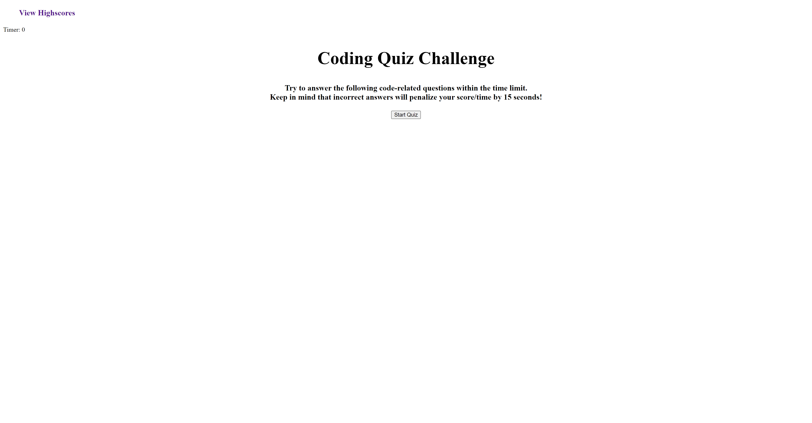

# code-quiz

## Description

Created a code quiz with minimal of 5 questions with answer choices.
 It was designed to have a timer of 60 seconds. The timer subtracts
 15 seconds each time the user answers incorrectly. By the end the
 quiz is over, user will get their score based on the number the timer stops.
 User can also put in their initials, that way it can be displayed next
 to their score.

 ## Screenshot of the Code Quiz

 

 ## Links
Code Quiz
- https://jovaldez98.github.io/code-quiz/

 ## Credits

 -Meg Meyers (TA)
